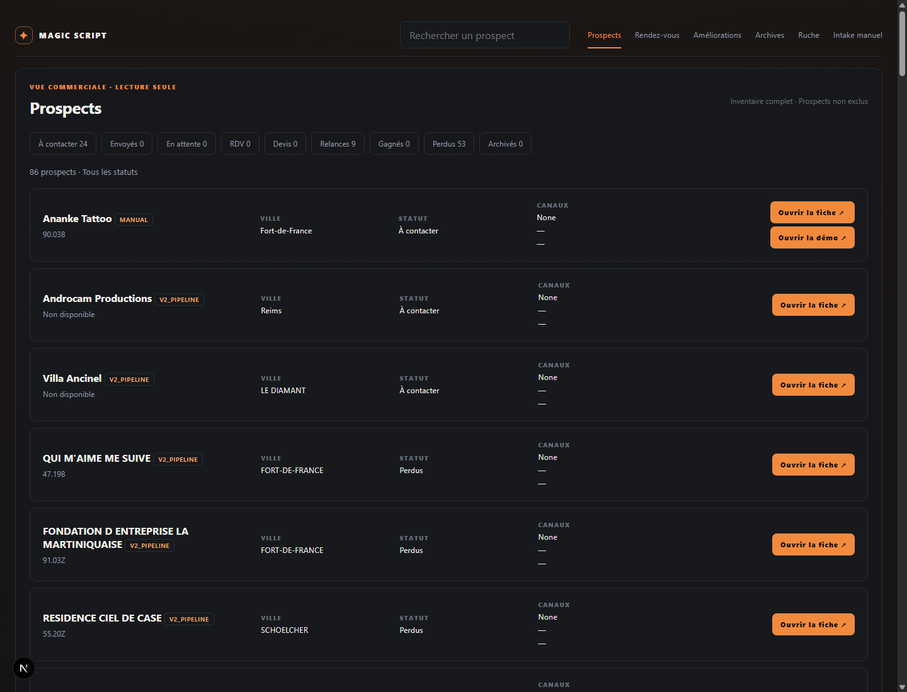
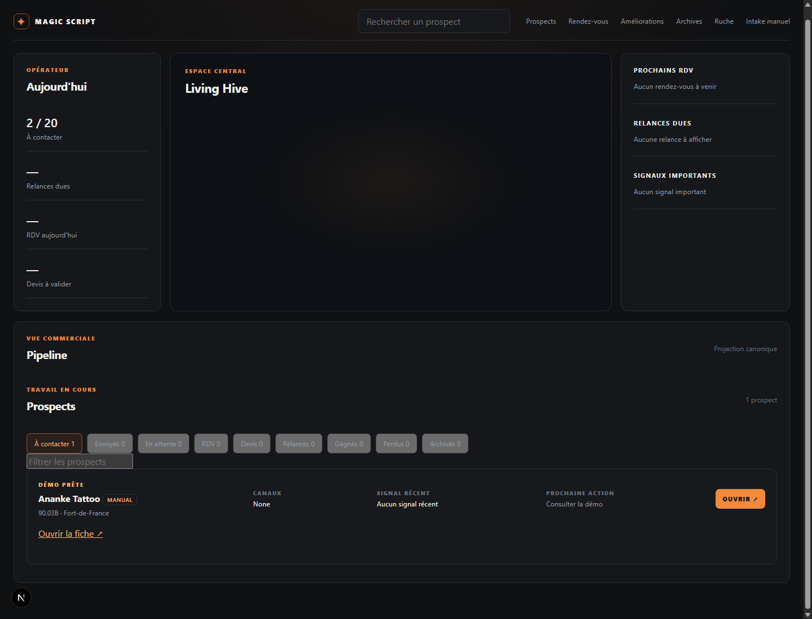
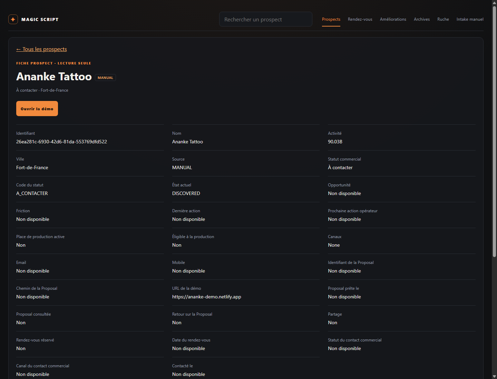

# Session D-bis — PASS local

## Résultat

- `/prospects` lit `/api/prospects` : **86 prospects non exclus**, dont Ananke Tattoo en MANUAL.
- Le deck central `/` conserve `/api/v2/deck` : **1 item**, Ananke Tattoo.
- Les **22 DO_NOT_CONTACT** restent absents des deux vues ; les 108 lignes sont conservées.
- Les neuf filtres commerciaux et les fiches ont été vérifiés dans Chrome réel via CDP.
- La démo d’Ananke est cliquable depuis la liste, le deck et la fiche ; Source = MANUAL dans la fiche.

## Découverte et décisions

Le schéma source et la table locale `prospects` ne possédaient ni `entry_source`, ni `demo_url`, ni `demo_ready`. Les champs existants `source_url`, `website_url` et `v2_domain` décrivent d’autres informations et ne portent pas cette autorité.

`listProposalDeck()` sélectionne les propositions PROPOSAL_READY, mais accepte aussi des prospects sans proposition via `nativeV2DeckEvidence()` : admission ADMITTED, design cohérent, contact qualifiant et verticale supportée. L’opérateur a explicitement demandé de préserver cette condition V2 exacte. La nouvelle branche MANUAL exige demo_ready = 1 et une URL HTTP(S) absolue analysable ; un prospect MANUAL DO_NOT_CONTACT est exclu.

`projectDeckCommercialPipeline()` gère les statuts commerciaux et les places de production. Cette projection est réutilisée sans modification. Une démo MANUAL n’acquiert aucune place de production et ne fabrique aucune proposition V2.

Avant modification : deck = 0 item, inventaire API = 86 non exclus + 22 exclus. La page `/prospects` lisait le deck. L’opérateur a ensuite autorisé sa connexion à l’inventaire complet. Le chiffre 85 de la mission initiale était dépassé par l’état local constaté.

## Migration et preuve SQL

Migration appliquée avec Wrangler à `magicscript-dev`, **local uniquement**, configuration `apps/api-worker/wrangler.local.jsonc`. Trois ALTER TABLE simples, avec DEFAULT et CHECK pour les valeurs et le préfixe HTTP(S). Aucun remplacement de table ni backfill. L’API du deck complète la vérification d’URL avec `new URL()`.

Une seule ligne a été mise à jour par l’injection SIRET : `changes() = 1`.

```sql
SELECT id, company_name, entry_source, demo_url, demo_ready
FROM prospects WHERE siret = '44971406200097';
```

| id | company_name | entry_source | demo_url | demo_ready |
|---|---|---|---|---|
| 26ea281c-6930-42d6-81da-553769dfd522 | Ananke Tattoo | MANUAL | https://ananke-demo.netlify.app | 1 |

Les empreintes avant/après de **tous les anciens champs** des 108 prospects, des 22 exclus et des places de production sont identiques. Les 107 autres lignes ont les nouveaux champs à leurs valeurs par défaut. Preuves : `baseline.json`, `verification.json` et script reproductible `verify.cjs`.

## Fichiers créés ou modifiés

- `database/migration-v2-entry-source-demo-ready-v1.sql` : migration locale.
- `database/schema.sql` : même définition pour les nouvelles bases et les fixtures.
- `apps/api-worker/src/index.ts` : origine/démo exposées dans les deux API ; branche MANUAL du deck.
- `apps/api-worker/src/deck-generic.integration.test.mjs` : migration, branche MANUAL, exclusions, non-régression V2 et inventaire.
- `apps/control-center/lib/deck.ts` : contrats et lecture séparée de l’inventaire ; configuration API existante inchangée.
- `apps/control-center/app/prospects/page.tsx` : inventaire complet.
- `apps/control-center/components/ProspectsList.tsx` : neuf filtres conservés, badges d’origine et liens.
- `apps/control-center/components/DeckPipeline.tsx` : badge et démo MANUAL dans les filtres existants ; règles V2 inchangées.
- `apps/control-center/app/prospects/[id]/page.tsx` : fiche disponible aussi hors deck, Source et démo.
- `apps/control-center/app/globals.css` : style discret des badges et liens.
- `outputs/session-d-bis/` : ce rapport, script, deux preuves JSON et trois captures.

Sessions A/B/C, correctifs TDZ/configuration de D, Cal.com, frontend magicscript-v2 : aucun changement dans leurs règles ou configurations. Aucun push ni déploiement.

## Vérification

- **61/61 tests réussis** : `deck-generic.integration.test.mjs`, `persisted-agent1-evidence.test.ts`, `deck-commercial-pipeline.test.ts`.
- Typecheck API : PASS.
- Typecheck Control Center sans émission : PASS.
- Compilation des pages modifiées en serveur Next local : PASS.
- `git diff --check` : PASS.
- Chrome **154.0.8037.93**, `http://127.0.0.1:3000` : 86 lignes inventaire, neuf filtres exercés, 1 ligne deck, badge MANUAL, clic vers fiche, lien démo vérifié et fiche d’un prospect hors deck vérifiée. Aucune exception JavaScript relevée.
- Comptages des filtres inventaire : À contacter 24, Perdus 53, Relances 9, autres 0.
- La disponibilité distante du site Netlify n’a pas été testée ; la preuve porte sur le lien cliquable dans le produit local. Aucun build de production ni test sur téléphone physique.

Captures :





## Commit

Commit unique demandé : `feat(deck): entry_source + demo_ready + Ananke en MANUAL (Session D-bis)`.
Le hash est fourni dans le message de livraison. La mutation D1 locale est attestée par les preuves ; la base locale n’est pas versionnée.

## USAGE REPORT

- Consommation propre à cette conversation : **USAGE_NOT_EXPOSED**.
- Quota compte au relevé final : **6 % restants sur 5 heures**, **31 % restants sur 7 jours**. Solde de crédits supplémentaires exposé : 0. Ces quotas sont partagés avec les autres conversations.
- Modèle exact et niveau de raisonnement : non exposés.
- Nombre exact d’appels outils : non exposé.
- MCP utilisés : `list_projects`, `search_graph`, `search_code`, `get_code_snippet`, `check_index_coverage`.
- Environ 15 fichiers de code applicatif/test/outillage ouverts directement, plus SQL, configurations et instructions.
- Fallback ciblé PowerShell/rg : oui. L’index était déjà disponible ; plusieurs chemins étaient signalés avec métadonnées modifiées et le SQL partiellement indexé. Aucun index créé ou reconstruit.
